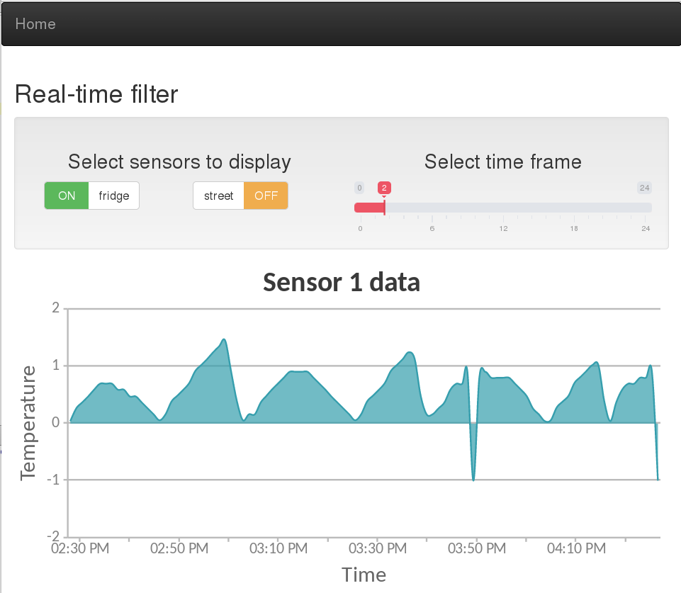

# fixFridge
Web interface for displaying real-time data from temperature sensors network

[fixFridge website](http://fixfridge.net)

#### Description
The main goal of the project when I started it was to develop a system for refridgerators repair shop. Also, the system should have the following characteristics:

* Measures temperature rate of change of a few refrigerators at the same time
* Collects all measurement data for further analysis and comparison
* Has very low power consumption characteristics
* Operates autonomously with least human interaction as possible

The hardware part can be found in another repo: https://github.com/mikedanylov/wireless-sensor

As for web interface, for now it is possible to open /realtime/ subpage and check data from two sensors in my appartment. One of them is located outside on the windowsill and another one is in the refrigerator.

#### TODO
* Logs view page (for analyzing old data)
    - [ ] page layout (should each sensor have three selectors?)
    - [ ] sensor selector
    - [ ] sensor filter
        + [ ] date selector
        + [ ] start time selector
        + [ ] end time selector
* Real-time page
    - [ ] update graph right after time frame is changed
